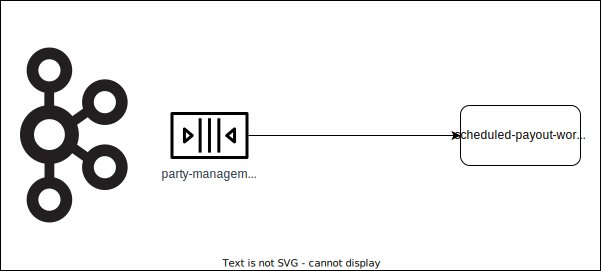
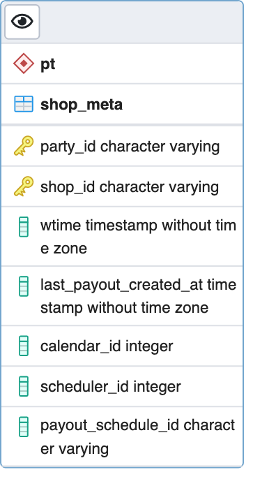

# scheduled-payout-worker

Сервис для формирования выплат по расписанию.

## Описание работы сервиса

### Верхнеуровневое описание взаимодействия

scheduled-payout-worker - сервис, предназначенный для обработки событий от сервиса [machinegun](https://github.com/valitydev/machinegun) с информацией о платежах и последующем формировании запроса на выплату к сервису [payout-manager](https://github.com/valitydev/payout-manager). 

События от сервиса machinegun поступают через Apache Kafka, данные о магазинах и выплатах хранятся в БД сервиса scheduled-payout-worker. Расписанием для выплат управляет отдельный сервис - [schedulator](https://github.com/valitydev/schedulator). При получении запроса от [schedulator'а](https://github.com/valitydev/schedulator) формируется запрос на выплату к сервису  [payout-manager](https://github.com/valitydev/payout-manager).

### Взаимодействие с Kafka

scheduled-payout-worker читает события из топика **party-management-topic**:

Топик содержит события с информацией о party/shop'е. Они делятся на два подтипа:

   1 События о создании shop'а, изменении платежного инструмента.

   На основе полученных событий в БД изменяется статус соответствующего shop'а (например, блокируется прием инвоисов)

   2 События с информацией о создании/изменении/удалении расписания выплат для магазина.

   В эту категорию попадают события о создании shop'а с заполненным payout_schedule (тогда создается расписание), либо события об изменении расписания (поле payout_schedule_changed), что может сигнализировать как о необходимости создать/обновить расписание, так и удалить его. На данном этапе фиксируются только дата и время выплаты, ее размер будет посчитан позднее (см. [взаимодействие с сервисом payout-manager](#взаимодействие-с-сервисом-payout-manager)).

   При получении событий, связанных с расписанием выплат, формируется запрос к сервису schedulator, который, при наступлении времени выплаты, выполнит вызов сервиса scheduled-payout-worker.

### Взаимодействие с сервисом schedulator

Протокол взаимодействия описан [тут](https://github.com/valitydev/schedulator-proto).

Схема взаимодействия:

Сервис scheduled-payout-worker отправляет запрос на создание/удаление запланированного job'а. В случае, когда наступает время выполнения job'а, schedulator вызывает сервис scheduled-payout-worker. 

### Взаимодействие с сервисом payout-manager

Протокол взаимодействия описан [тут](https://github.com/valitydev/payout-manager-proto).

При получении запроса от сервиса schedulator, scheduled-payout-worker расчитывает сумму и валюту выплаты для магазина на основе данных в БД и отправляет запрос к сервису payout-manager.
Расчет суммы происходит на основе всех финансовых операций (рефанды, платежы, корректировки и т.д.) ранее не попадавших в выплаты (не заполнено поле payout_id), в разрезе определенного магазина и за определенный интервал времени (время срабатывания schedulator'а - 7 дней).

### Схема БД

Помимо описанных выше взаимодействий, scheduled-payout-worker также взаимодействует с сервисами:

- [party-management](https://github.com/valitydev/party_management) (для получения актуальной информации о party/shop'е)
- [dominant](https://github.com/valitydev/dominant) (для получения актуальной информации о календаре выплат)
- [claim-management](https://github.com/valitydev/claim-management) (сервис может присылать запросы на создание/удаление расписания выплат)
- [shumway](https://github.com/valitydev/shumway) (для получения баланса по конкретному магазину на определенный момент времени)

Общая схема взаимодействия отображена ниже:

